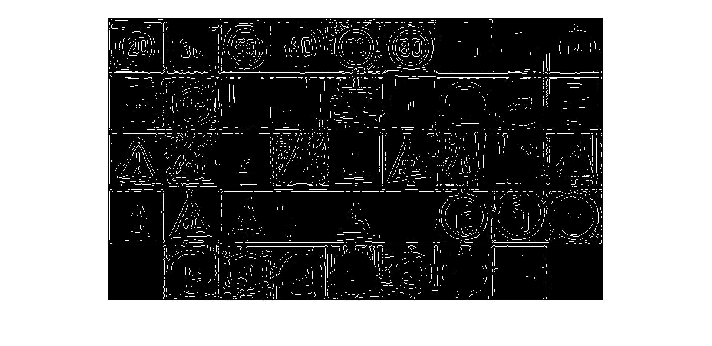

# CSE-4019-19BCE2186

**Review 2 progress for J component of CSE-4019**

**Project Name**: Traffic Sign Classification

**Project Arena**: Laplacian filter and Segmentation

## Progress till now


we see a normal sample image


the edges are detected by LAPLACIAN filter

## Future work

```
1. Training of the model to identify signs.
2. External image confirmation.
3. Fix detection on Traffic Signs.

```

**Image Dataset** = [link](https://bitbucket.org/jadslim/german-traffic-signs/src/master/)
